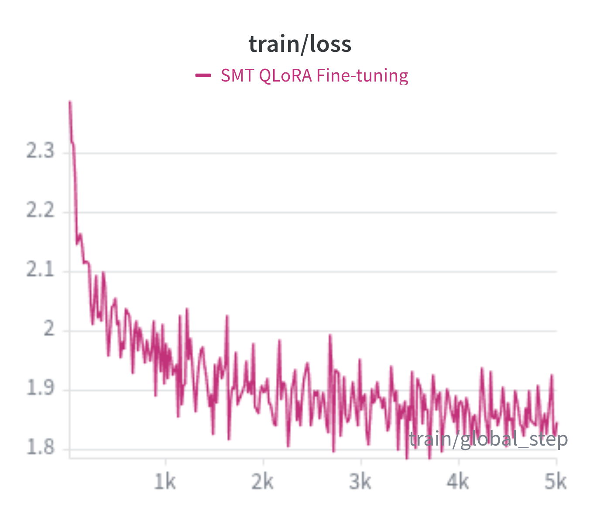
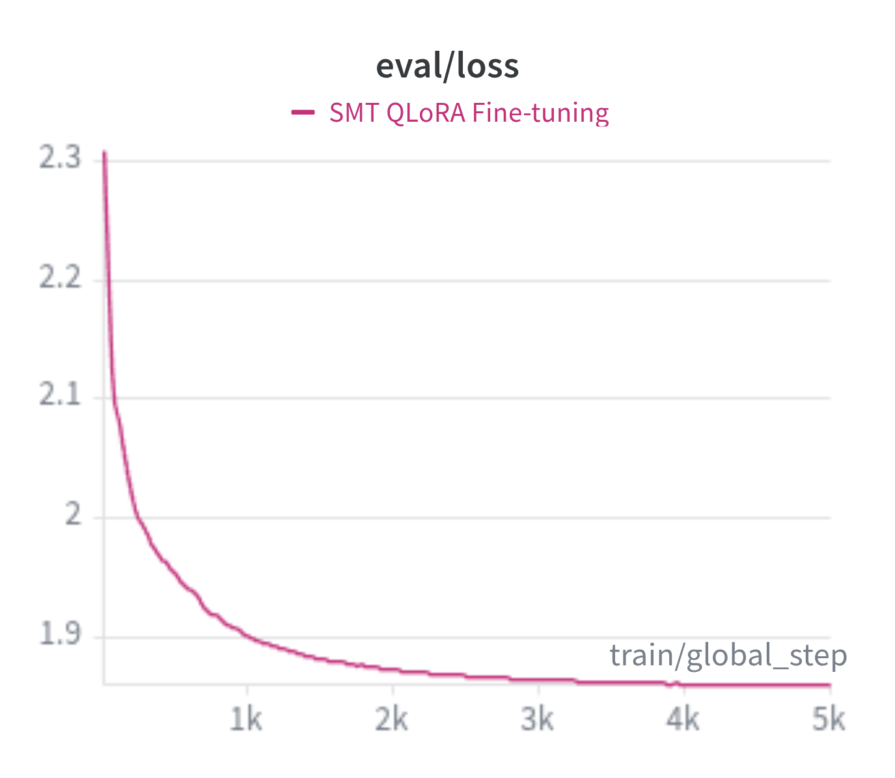
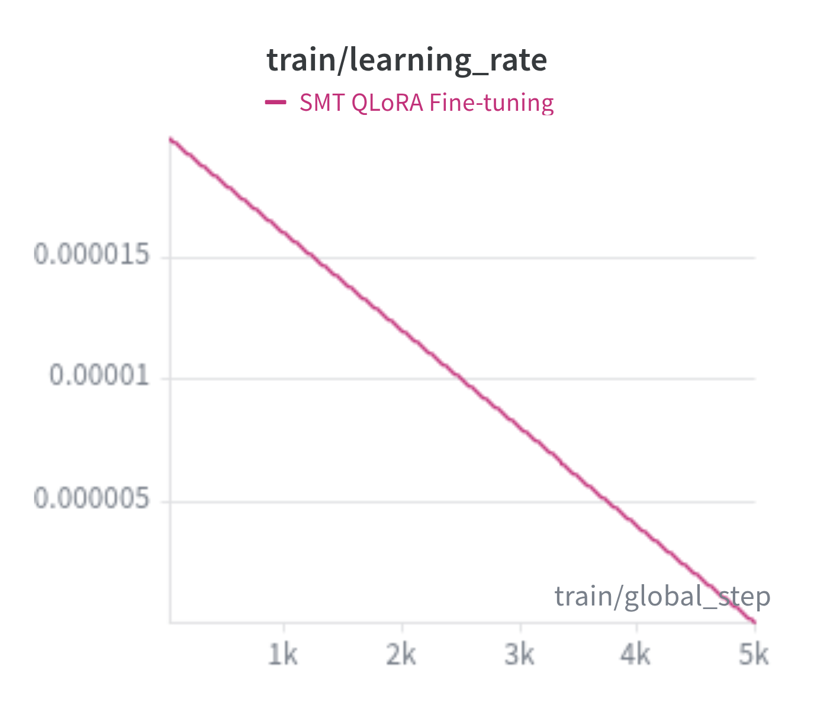
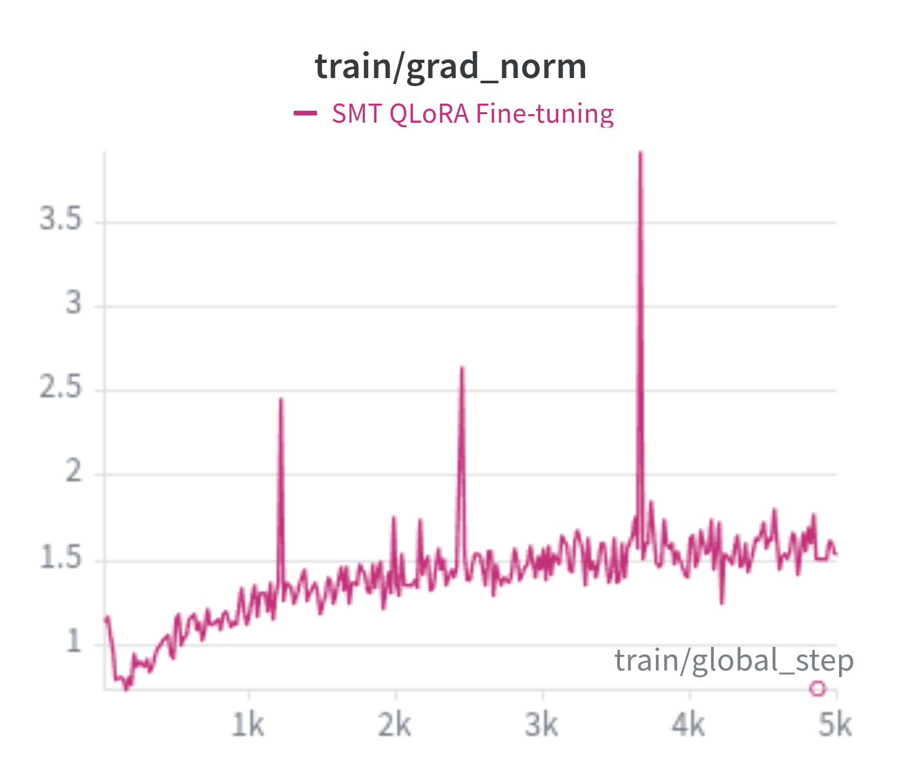
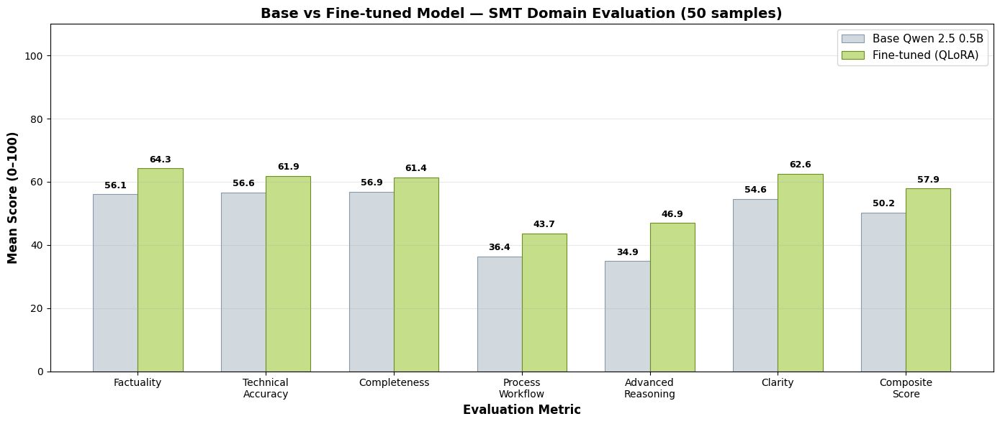

# Evolutionary Synthetic Data Generation for Domain-Adaptive Fine-Tuning of LLMs in Surface Mount Technology

This repository implements an end-to-end pipeline for generating high-quality SMT (Surface Mount Technology) instruction-tuning datasets using evolutionary text generation, fine-tuning a small language model via QLoRA, and evaluating the results with an LLM-as-judge framework.

---

## Table of Contents

- [Repository Structure](#repository-structure)
- [Evolutionary Text Generator](#evolutionary-text-generator)
  - [Pipeline Overview](#pipeline-overview)
  - [Generational Loop](#generational-loop)
  - [AI-Align-AI Refinement](#ai-align-ai-refinement)
  - [Evaluation and Ranking](#evaluation-and-ranking)
- [Instruction Fine-Tuning](#instruction-fine-tuning)
  - [Dataset](#dataset)
  - [QLoRA Configuration](#qlora-configuration)
  - [Training Hyperparameters](#training-hyperparameters)
  - [Training Logs](#training-logs)
- [Evaluation](#evaluation)
- [Getting Started](#getting-started)
  - [Prerequisites](#prerequisites)
  - [Installation](#installation)
  - [Inference from the Fine-Tuned Model](#inference-from-the-fine-tuned-model)
- [HuggingFace Resources](#huggingface-resources)

---

## Repository Structure

```
.
├── Evolution_QA_dataset_generation/
│   ├── text_generation.py                # Core EvolutionaryTextGenerator class
│   ├── data_synthesis.py                 # High-level data synthesis orchestrator
│   ├── training_data_synthesizer.py      # TrainingDataSynthesizer for instruction-response pairs
│   ├── conversation_synthesizer.py       # Multi-turn conversation generation
│   ├── evaluation_utils.py               # LLM-as-judge scoring and ranking utilities
│   ├── generation_types.py               # GenerationType enum (INSTRUCTION, RESPONSE, TEXT)
│   ├── json_utils.py                     # JSON extraction from LLM outputs
│   ├── evol_qa.ipynb                     # Notebook for running the generation pipeline
│   ├── generator.svg                     # Evolutionary generator workflow diagram
│   ├── evaluated_metric_results.png      # Evaluation comparison bar chart
│   ├── navigator_agent_augment_data_flow.png  # AAA data flow sequence diagram
│   ├── train_loss_square.png             # Training loss curve
│   ├── eval_loss_sq.png                  # Evaluation loss curve
│   ├── learning_rate_sq.png              # Learning rate schedule
│   ├── grad_norm_sq.png                  # Gradient norm curve
│   └── README.md
├── Instruction-tuning.ipynb              # Full fine-tuning pipeline notebook
├── Evaluation.ipynb                      # LLM-as-judge evaluation notebook
├── evaluation_results.csv                # Evaluation scores (semicolon-delimited)
└── README.md
```

---

## Evolutionary Text Generator

The core data generation engine synthesises instruction–response pairs through a multi-generational evolutionary loop inspired by genetic algorithms, combined with LLM-as-judge selection pressure.

### Pipeline Overview

<p align="center">
  
</p>


### Generational Loop

For each input context passage, the generator first performs **Initial Population Seeding** — the LLM is called N times (`population_size`, default: 5) with the same prompt; stochastic temperature produces diverse candidates.

Then, the following evolutionary cycle repeats for G generations (default: 3):

1. **Mutation** — Each candidate has a probability `p` (`mutation_rate`, default: 0.5) of being rewritten by the LLM with a mutation prompt that varies phrasing and structure while preserving meaning.

2. **Complexity Measurement** — Each candidate is scored on a 1–5 scale by the LLM, assessing:
   - Language difficulty
   - Concept density
   - Assumed prior knowledge
   
   A `complexity_target` (default: 3) penalises candidates that deviate from the desired complexity level.

3. **Quality Filtering — Strict** — LLM evaluates batches of candidates with a binary pass/fail gate (conciseness, clarity, context-alignment). If all candidates are filtered out:
   - **3b. Relaxed Filtering** — Keep all candidates regardless of verdict.
   - **3c. Fallback** — If still empty, reuse the previous generation's population.

4. **Relative Ranking** — LLM compares all survivors side-by-side and assigns ordinal ranks based on: quality, relevance, factual accuracy, prompt adherence, inverse bias, inverse toxicity. Ranks are converted to proportional scores:
   ```
   score = (N - rank + 1) / N × 100
   ```

5. **Complexity-Adjusted Ranking** — Raw ranks are adjusted by complexity distance from the target:
   ```
   adjusted_rank = rank + |complexity - target|
   ```

6. **Diverse Selection** — The next generation's population is formed through:
   - **Elite selection**: Row 0 with best `r_adj` always survives
   - **Stratified random sampling**: Remaining N−1 slots are filled by dividing candidates into equal groups and randomly picking from each

After the final generation, a **Final Ranking Pass** (same ranking + complexity adjustment, no mutation or filtering) selects Row 0 (lowest `r_adj`) as the best evolved text.

### AI-Align-AI Refinement(Set to Optional by default)

When `use_aaa=True`, the best evolutionary output undergoes a three-stage refinement:

1. **Co-Teaching** — Multiple secondary LLMs (`co_teach_llms`) independently improve the text. The primary LLM selects the best co-teaching variant.
2. **Self-Teaching** — The primary LLM generates improvement suggestions, then incorporates them into a refined version.
3. **Final Selection** — The primary LLM chooses among the Original, Co-Teaching, and Self-Teaching versions.

This process is applied independently to both instructions and responses.

### Evaluation and Ranking

The `evaluation_utils.py` module provides two evaluation mechanisms:

**Absolute Scoring** (`evaluate_texts`) — Each text is scored 0–100 on six metrics:

| Metric | Weight | Direction |
|--------|--------|-----------|
| Quality | 1.0 | Higher is better |
| Relevance | 1.0 | Higher is better |
| Factual Accuracy | 2.0 | Higher is better |
| Prompt Adherence | 1.0 | Higher is better |
| Bias | 1.0 | Lower is better (inverse) |
| Toxicity | 1.0 | Lower is better (inverse) |

The composite score is computed as a weighted average:

$$S = \frac{\sum s_i \cdot w_i}{\sum w_i}$$

where inverse metrics use $(100 - s_i)$.

**Relative Ranking** (`relative_ranking`) — All candidates are compared head-to-head by the LLM judge, producing ordinal ranks converted to proportional scores.

---

## Instruction Fine-Tuning

### Dataset

The evolutionarily generated dataset is hosted on HuggingFace:

> **[`ritwik-ghosh/SMT_Fine-tuning_dataset`](https://huggingface.co/datasets/ritwik-ghosh/SMT_Fine-tuning_dataset)**

- **639 total samples** with fields: `Context`, `instruction`, `response`
- Samples exceeding 8,000 characters are removed as outliers
- Split: **80% train / 20% test** (seed=42)
- Prompt format uses the Alpaca template with optional context:

```
Below is an instruction that describes a task, paired with an input that provides further context.
Write a response that appropriately completes the request.

### Instruction:
{instruction}

### Input:
{context}

### Response:
{response}
```

### QLoRA Configuration

| Parameter | Value |
|-----------|-------|
| Base Model | `Qwen/Qwen2.5-0.5B` |
| Quantisation | 4-bit NF4 with double quantisation |
| Compute dtype | `bfloat16` |
| LoRA rank (`r`) | 16 |
| LoRA alpha (`lora_alpha`) | 32 |
| LoRA dropout | 0.05 |
| Bias | None |
| Task type | `CAUSAL_LM` |

### Training Hyperparameters

| Parameter | Value |
|-----------|-------|
| Batch size (per device) | 2 |
| Gradient accumulation steps | 2 |
| Effective batch size | 4 |
| Learning rate | 2e-4 |
| Optimiser | `paged_adamw_8bit` |
| Precision | FP16 |
| Epochs | 3 |
| Max steps | 500 |
| Trainer | `SFTTrainer` (TRL) |

### Training Logs

The training was tracked with Weights & Biases. Key curves:

#### Training Loss
<p align="center">
  
</p>

Training loss decreased from ~2.35 to ~1.85 over 5k steps, showing steady convergence with typical noise from the small effective batch size.

#### Evaluation Loss
<p align="center">
  
</p>

Evaluation loss dropped sharply in the first 1k steps (2.30 → 1.90) and plateaued around 1.87, indicating good generalisation with no sign of overfitting.

#### Learning Rate Schedule
<p align="center">
  
</p>

A linear decay schedule from 2e-4 to 0, providing aggressive early learning followed by fine-grained refinement.

#### Gradient Norm
<p align="center">
  
</p>

Gradient norms remained largely stable (0.8–1.5) with occasional spikes up to ~3.8, consistent with the varied sequence lengths in the SMT dataset.

---

## Evaluation

The fine-tuned model is evaluated against the base Qwen 2.5 0.5B using an **LLM-as-judge** framework with six SMT-domain-specific metrics, scored on 50 held-out test samples:

<p align="center">
  
</p>

| Metric | Base Model | Fine-Tuned | Improvement |
|--------|-----------|------------|-------------|
| Factuality (weight 2×) | 56.1 | 64.3 | +8.2 (+14.5%) |
| Technical Accuracy | 56.6 | 61.9 | +5.3 (+9.4%) |
| Completeness | 56.9 | 61.4 | +4.5 (+8.0%) |
| Process Workflow Knowledge | 36.4 | 43.7 | +7.3 (+20.1%) |
| Advanced Research Reasoning | 34.9 | 46.9 | +12.0 (+34.4%) |
| Clarity | 54.6 | 62.6 | +8.0 (+14.6%) |
| **Composite Score** | **50.2** | **57.9** | **+7.6 (+15.2%)** |

The fine-tuned model outperformed the base in **35 out of 50** test samples. The largest relative gains were in Advanced Research Reasoning (+34.4%) and Process Workflow Knowledge (+20.1%).

The evaluation notebook (`Evaluation.ipynb`) supports both **OpenAI** and **Ollama** as LLM judge providers, configurable via a single variable.

---

## Getting Started

### Prerequisites

- Python 3.10+
- CUDA-capable GPU (12 GB+ VRAM recommended)
- [Ollama](https://ollama.com/) (optional, for local LLM-as-judge evaluation)

### Installation

```bash
# Clone the repository
git clone <repo-url>
cd SMT\ LLM

# Create virtual environment
python3 -m venv .venv
source .venv/bin/activate

# Install dependencies
pip install torch transformers datasets accelerate peft bitsandbytes \
            pandas tqdm requests matplotlib numpy
```

### Inference from the Fine-Tuned Model

```python
import torch
from transformers import AutoModelForCausalLM, AutoTokenizer

# Load tokenizer and model
tokenizer = AutoTokenizer.from_pretrained(
    "ritwik-ghosh/Qwen2.5_0.5B_SMT_QLoRA-fine-tuned_tokenizer"
)
model = AutoModelForCausalLM.from_pretrained(
    "ritwik-ghosh/SMT-LLM",
    device_map={"": 0}
)

# Define prompt (instruction-only, no context)
instruction = "How to accurately predict the surface tension of a lead-free solder?"

prompt = (
    "Below is an instruction that describes a task. "
    "Write a response that appropriately completes the request.\n\n"
    f"### Instruction:\n{instruction}\n\n"
    "### Response:\n"
)

# Generate
inputs = tokenizer(prompt, return_tensors="pt", return_token_type_ids=False).to("cuda:0")
outputs = model.generate(
    **inputs,
    max_new_tokens=1000,
    do_sample=True,
    temperature=0.8,
    top_k=50,
    top_p=0.9,
    repetition_penalty=1.2,
)

response = tokenizer.decode(outputs[0], skip_special_tokens=True)
print(response.split("### Response:")[-1].strip())
```

To include context with the instruction:

```python
prompt = (
    "Below is an instruction that describes a task, paired with an input "
    "that provides further context. "
    "Write a response that appropriately completes the request.\n\n"
    f"### Instruction:\n{instruction}\n\n"
    f"### Input:\n{context}\n\n"
    "### Response:\n"
)
```

### Generation Parameters

| Parameter | Value |
|-----------|-------|
| `max_new_tokens` | 1000 |
| `do_sample` | True |
| `temperature` | 0.8 |
| `top_k` | 50 |
| `top_p` | 0.9 |
| `repetition_penalty` | 1.2 |

---

## HuggingFace Resources

| Resource | Link |
|----------|------|
| Fine-tuned Model (LoRA adapters) | [`ritwik-ghosh/SMT-LLM`](https://huggingface.co/ritwik-ghosh/SMT-LLM) |
| Tokenizer | [`ritwik-ghosh/Qwen2.5_0.5B_SMT_QLoRA-fine-tuned_tokenizer`](https://huggingface.co/ritwik-ghosh/Qwen2.5_0.5B_SMT_QLoRA-fine-tuned_tokenizer) |
| Base Model | [`Qwen/Qwen2.5-0.5B`](https://huggingface.co/Qwen/Qwen2.5-0.5B) |
| Dataset | [`ritwik-ghosh/SMT_Fine-tuning_dataset`](https://huggingface.co/datasets/ritwik-ghosh/SMT_Fine-tuning_dataset) |
